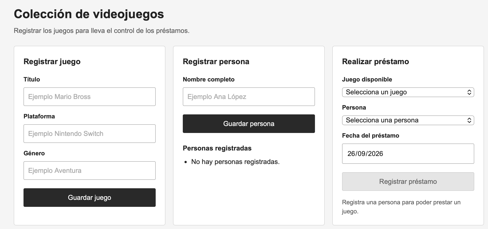
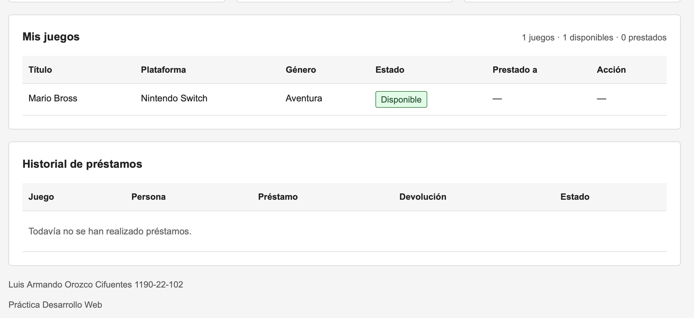
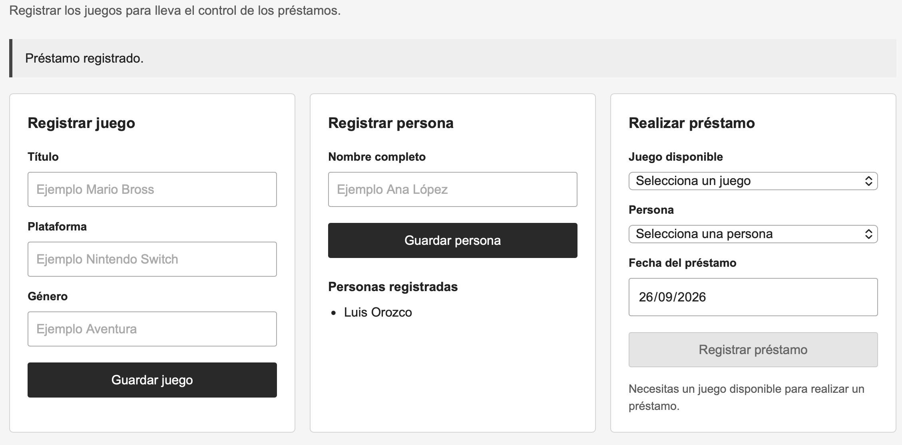
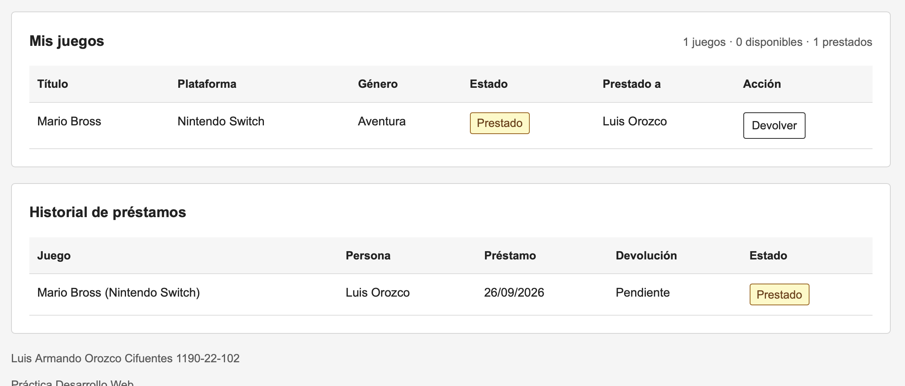
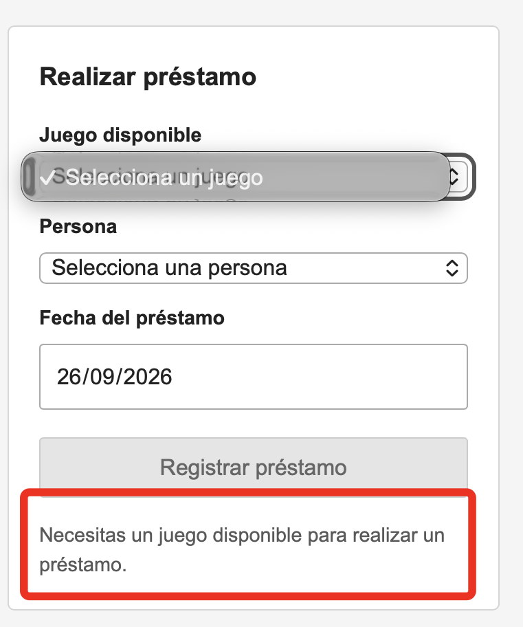
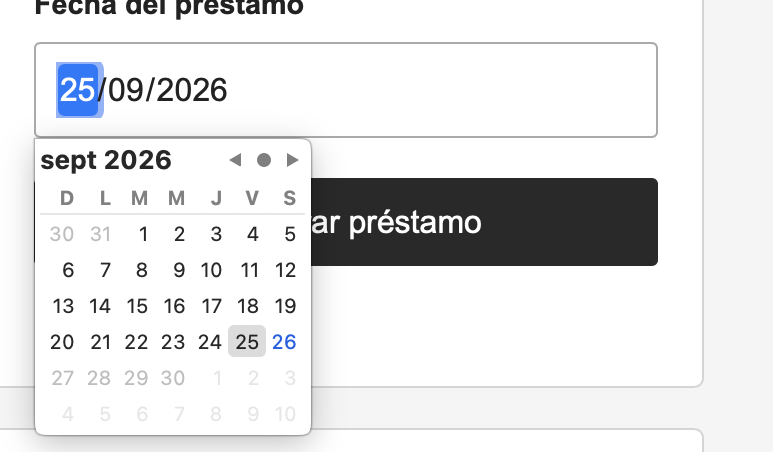
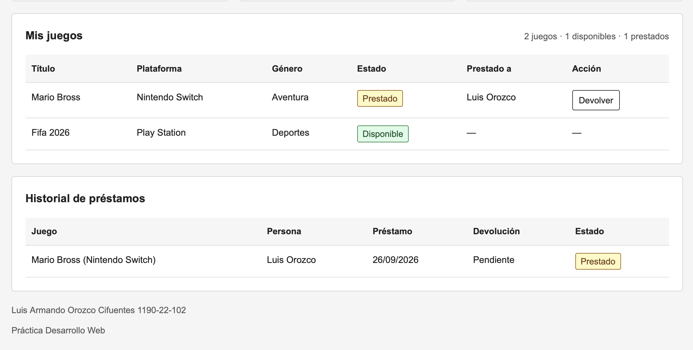
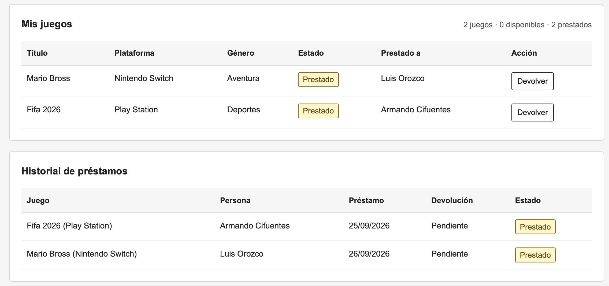
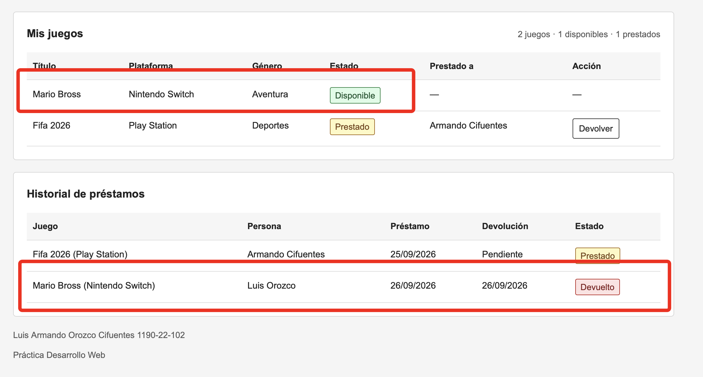

Registramos un juego, una persona y un préstamo

Regitramos los datos

Si no hay juegos disponibles no me deja prestarlos, es parte de la logica basica del programa

Tampoco deja seleccionar fechas futuras siempre como parte de la lógica básica

Se puede obvservar el estado de los juegos dispobibles

Vamos a realizar una devolución

vemos que cambia el estado del juego

***Todo se guarda en base de datos local con Sqlite***
